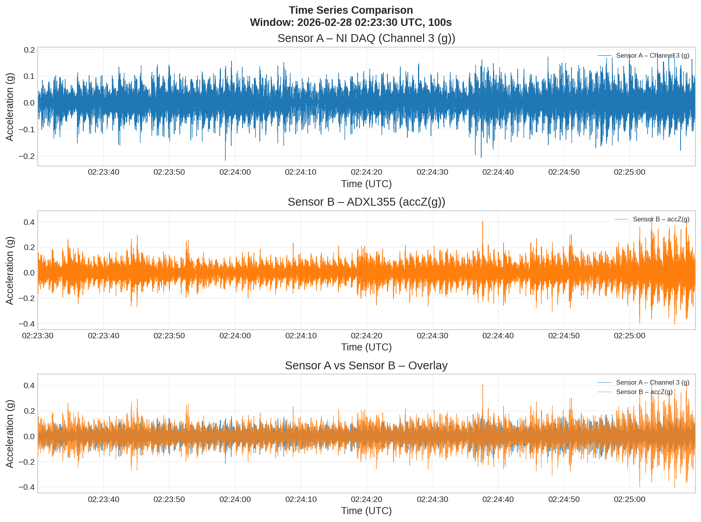
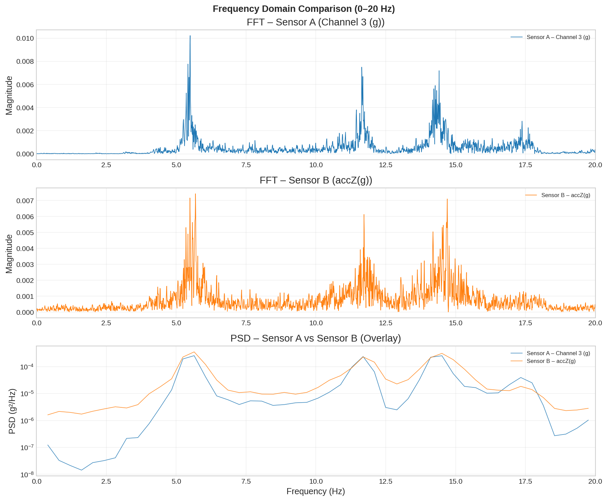
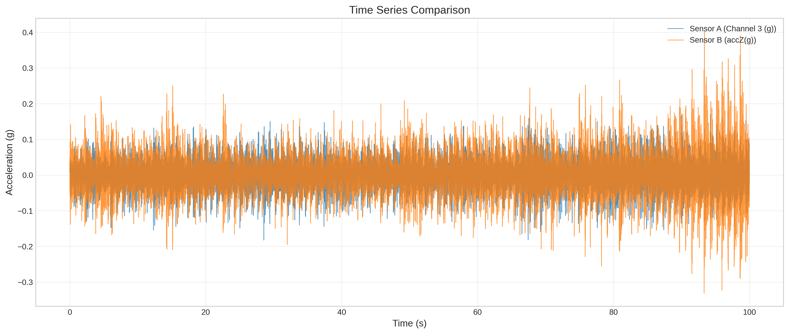
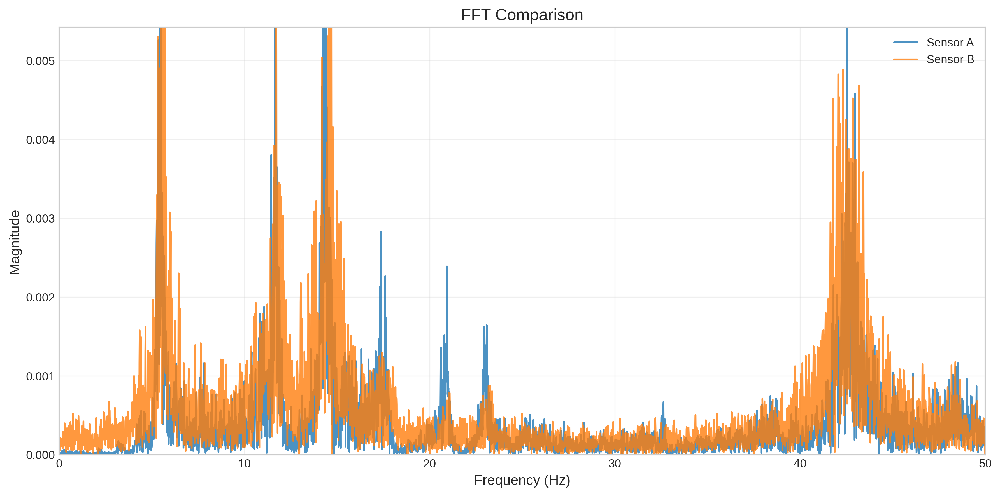
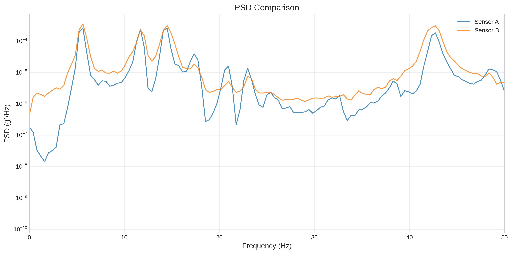
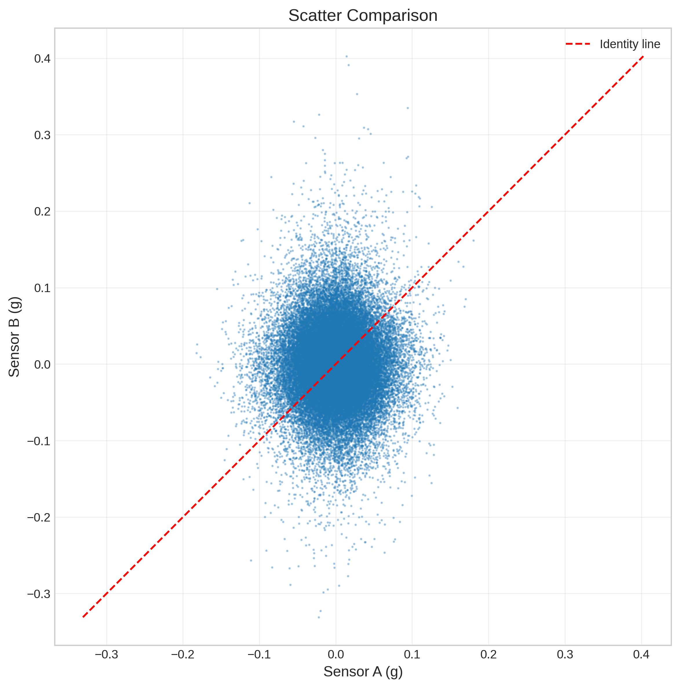
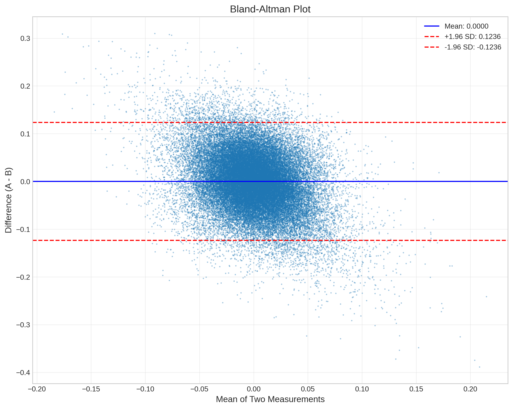
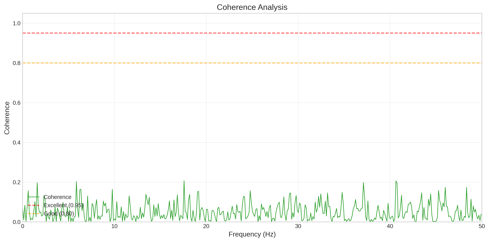

# Full Comparison Report: Sensor A Channel 3 (g) vs Sensor B accZ(g)

Generated: 2026-03-02 08:07:37

---

## Time Domain Statistics

| Metric | Sensor A | Sensor B | Difference |
|--------|----------|----------|------------|
| mean | -0.000006 | -0.000027 | 0.000020 |
| std | 0.036617 | 0.051602 | -0.014985 |
| rms | 0.036617 | 0.051602 | -0.014985 |
| peak | 0.182414 | 0.402612 | -0.220197 |
| peak_to_peak | 0.362620 | 0.733550 | -0.370930 |
| crest_factor | 4.981638 | 7.802232 | -2.820594 |

## Correlation Analysis

- Pearson r: 0.007457
- R²: 0.000056
- Spearman r: -0.003441

## Error Metrics

- Pearson r: 0.007457 [95% CI: -0.002972, 0.016835]
- MAE: 0.048712 [95% CI: 0.048364, 0.049059]
- RMSE: 0.063051 [95% CI: 0.062604, 0.063543]
- NRMSE: 0.173876
- Max Error: 0.388504

## Coherence Analysis

- Mean coherence: 0.0481 (Poor)
- Min coherence: 0.0000

## Bland-Altman Analysis

- Mean difference: 0.000020
- Std difference (ddof=1): 0.063052
- Upper LoA: 0.123599
- Lower LoA: -0.123558

### Normality Test (Shapiro-Wilk)

- Statistic: 0.995030
- p-value: 0.000000
- Result: Differences are **not normally distributed** (p <= 0.05) — LoA should be interpreted with caution

## Frequency Domain Analysis

| Metric | Sensor A | Sensor B |
|--------|----------|----------|
| dominant_frequency | 5.50 Hz | 5.69 Hz |
| spectral_centroid | 36.45 Hz | 62.73 Hz |
| median_frequency | 15.72 Hz | 42.35 Hz |

## Figures

### Time Series — Sensor A, Sensor B, Overlay (UTC axis)

### Frequency Domain — FFT A, FFT B, PSD Overlay (0–20 Hz)

### Time Series — Overlay (resampled)

### FFT Comparison

### PSD Comparison

### Scatter Plot

### Bland-Altman Plot

### Coherence Analysis

## Frequency Band Analysis (0–20 Hz)

### Per-sensor Statistics

| Metric | Sensor A | Sensor B | Difference |
|--------|----------|----------|------------|
| mean (magnitude) | 0.000525 | 0.000778 | -0.000252 |
| std (magnitude) | 0.000863 | 0.000866 | -0.000004 |
| rms (magnitude) | 0.001010 | 0.001164 | -0.000154 |
| peak (magnitude) | 0.010227 | 0.007425 | 0.002802 |
| peak frequency (Hz) | 5.500000 | 5.690000 | -0.190000 |
| spectral energy | 0.002042 | 0.002710 | -0.000668 |

- **Energy ratio (A/B)**: 0.7534

### Spectral Comparison Metrics

| Metric | Value |
|--------|-------|
| Pearson r (spectra) | 0.564525 |
| MAE (magnitude) | 0.000508 |
| RMSE (magnitude) | 0.000845 |
| NRMSE (magnitude) | 0.082640 |

## Interpretation

- **Correlation (Pearson r = 0.0075)**: Poor
- **NRMSE = 0.1739 (17.4%)**: Poor
- **Dominant frequency**: matched (5.50 Hz vs 5.69 Hz) — same vibration source confirmed

**Conclusion**: Both sensors capture the same dominant vibration frequency, but waveform correlation is low. This is consistent with sensors placed at different physical locations on the structure, where vibration amplitude and phase differ. Time-lag sweep (cross-correlation over full data) confirmed no single offset improves correlation significantly (peak r < 0.08 across all channels). The low correlation is therefore attributed to spatial differences in sensor placement, not to timestamp misalignment.